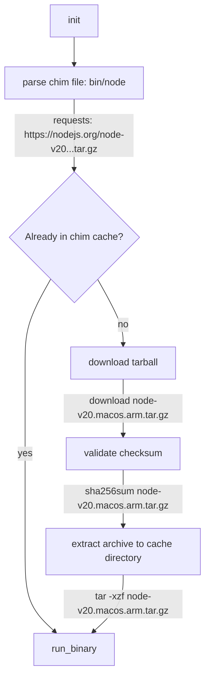

# [chim](https://chim.sh/)

_Cross-platform binary shims with optional remote fetching._

## Quickstart (make an automatic fetching node.js wrapper)

Install chim: (see docs for [alternate install methods](https://chim.sh/docs/installing/))

```
$ cargo install chim
$ chim --version
chim 0.1.0-alpha.6
```

Create a chim in `./bin/node`:

```toml
#!/usr/bin/env chim
[macos-arm64]
url = 'https://nodejs.org/dist/v18.7.0/node-v18.7.0-darwin-arm64.tar.gz'
path = 'node-v18.7.0-darwin-arm64/bin/node'
checksum = 'ea24b35067bd0dc40ea8fda1087acc87672cbcbba881f7477dbd432e3c03343d'

[linux-x64]
url = 'https://nodejs.org/dist/v18.7.0/node-v18.7.0-linux-x64.tar.xz'
path = 'node-v18.7.0-linux-x64/bin/node'
```

Now make it executable and run it:

```
$ chmod +x ./bin/node
$ ./bin/node -v
v18.7.0
```

The tarball is fetched once from nodejs.org, extracted into a cache directory, then reused on future `./bin/node` calls.

## What am I supposed to do with this?

Commit a set of chims into a `/bin` directory in your project's repo. Other people can just add this directory to their
`$PATH` and won't have to manually install each utility. Also run the chims in CI/CD so you have dev/prod parity with
your tools!

## Diagram

Here's a flow chart of a [chim execution](https://chim.sh/docs/how-it-works):



## TODO

This project is a WIP

- [ ] git://
- [ ] homebrew release
- [ ] snapcraft release
- [ ] apt release (see goreleaser)
- [ ] aur release
- [ ] flatpak release
- [ ] github actions demo
- [ ] chimstrap checksum automation
