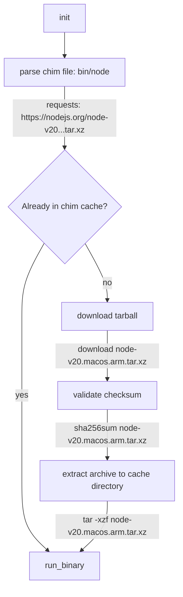

# [chim](https://chim.sh/)

[](https://github.com/jdxcode/chim/actions/workflows/chim.yml)

_Cross-platform binary shims with optional remote fetching._

## Quickstart (make an automatic fetching node.js wrapper)

Install chim: (see docs for [alternate install methods](https://chim.sh/docs/installing/))

```
$ cargo install chim
$ chim --version
chim 1.0.1
```

Create a chim in `./bin/node`:

```toml
#!/usr/bin/env chim
[macos-arm64]
url = 'https://nodejs.org/dist/v18.7.0/node-v18.7.0-darwin-arm64.tar.xz'
path = 'node-v18.7.0-darwin-arm64/bin/node'
checksum = 'ef593cbb3a3f0aae9879b74a7850d794abab26178aa5e0f67ff182894811e6f0'

[linux-x64]
url = 'https://nodejs.org/dist/v18.7.0/node-v18.7.0-linux-x64.tar.xz'
path = 'node-v18.7.0-linux-x64/bin/node'
checksum = '8bc6a1b9deaed2586d726fc62d4bee9c1bfc5a30b96c1c4cff7edd15225a11a2'

[windows-x64]
url = 'https://nodejs.org/dist/v18.7.0/node-v18.7.0-win-x64.zip'
path = 'node-v18.7.0-win-x64\node.exe'
checksum = '9c0abfe32291dd5bed717463cb3590004289f03ab66011e383daa0fcec674683'
```

Now make it executable and run it:

```
$ chmod +x ./bin/node
$ ./bin/node -v
v18.7.0
```

The tarball is fetched once from nodejs.org, extracted into a cache directory, then reused on future `./bin/node` calls.

## What am I supposed to do with this?

Commit a set of chims into a `/bin` directory in your project's repo. Other people can just add this directory to their
`$PATH` and won't have to manually install each utility. Also run the chims in CI/CD so you have dev/prod parity with
your tools!

## Diagram

Here's a flow chart of a [chim execution](https://chim.sh/docs/how-it-works):


